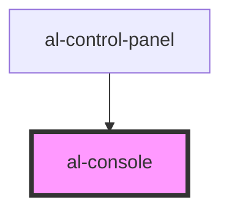

# al-console

<!-- Auto Generated Below -->

## Properties

| Property | Attribute | Description | Type     | Default     |
| -------- | --------- | ----------- | -------- | ----------- |
| `graph`  | `graph`   |             | `string` | `undefined` |

## Events

| Event            | Description | Type               |
| ---------------- | ----------- | ------------------ |
| `graphSubmitted` |             | `CustomEvent<any>` |

## Dependencies

### Used by

 - [al-control-panel](..\al-control-panel)

### Graph

----------------------------------------------

*Built with [StencilJS](https://stenciljs.com/)*
