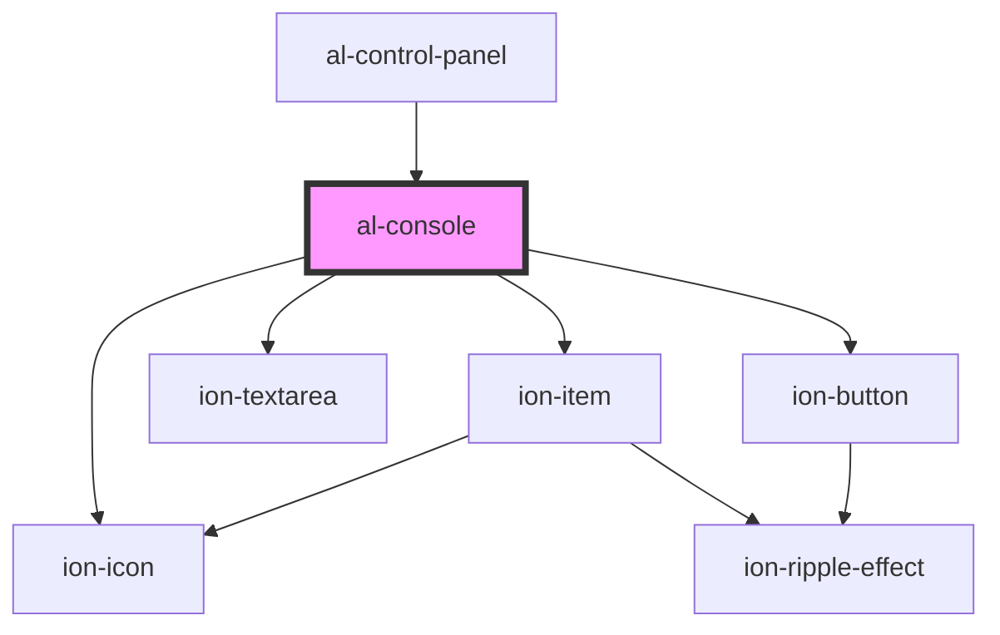

# al-console

<!-- Auto Generated Below -->

## Properties

| Property  | Attribute  | Description | Type     | Default |
| --------- | ---------- | ----------- | -------- | ------- |
| `graph`   | `graph`    |             | `string` | `null`  |
| `tabSize` | `tab-size` |             | `number` | `2`     |

## Events

| Event            | Description | Type               |
| ---------------- | ----------- | ------------------ |
| `graphSubmitted` |             | `CustomEvent<any>` |

## Dependencies

### Used by

 - [al-control-panel](..\al-control-panel)

### Depends on

- ion-item
- ion-textarea
- ion-button
- ion-icon

### Graph

----------------------------------------------

*Built with [StencilJS](https://stenciljs.com/)*
