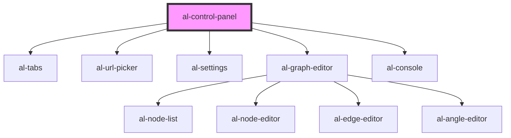

# al-control-panel

<!-- Auto Generated Below -->

## Properties

| Property             | Attribute              | Description | Type                                                           | Default     |
| -------------------- | ---------------------- | ----------- | -------------------------------------------------------------- | ----------- |
| `angles`             | --                     |             | `Map<string, AlAngle>`                                         | `null`      |
| `boundingBoxEnabled` | `bounding-box-enabled` |             | `boolean`                                                      | `undefined` |
| `consoleTabEnabled`  | `console-tab-enabled`  |             | `boolean`                                                      | `true`      |
| `controlsType`       | `controls-type`        |             | `ControlsType.ORBIT \| ControlsType.TRACKBALL`                 | `undefined` |
| `displayMode`        | `display-mode`         |             | `DisplayMode.MESH \| DisplayMode.SLICES \| DisplayMode.VOLUME` | `undefined` |
| `edges`              | --                     |             | `Map<string, AlEdge>`                                          | `null`      |
| `graphEnabled`       | `graph-enabled`        |             | `boolean`                                                      | `undefined` |
| `graphTabEnabled`    | `graph-tab-enabled`    |             | `boolean`                                                      | `true`      |
| `nodes`              | --                     |             | `Map<string, AlNode>`                                          | `null`      |
| `selected`           | `selected`             |             | `string`                                                       | `null`      |
| `settingsTabEnabled` | `settings-tab-enabled` |             | `boolean`                                                      | `true`      |
| `slicesBrightness`   | `slices-brightness`    |             | `number`                                                       | `undefined` |
| `slicesContrast`     | `slices-contrast`      |             | `number`                                                       | `undefined` |
| `slicesIndex`        | `slices-index`         |             | `number`                                                       | `undefined` |
| `slicesMaxIndex`     | `slices-max-index`     |             | `number`                                                       | `undefined` |
| `srcTabEnabled`      | `src-tab-enabled`      |             | `boolean`                                                      | `true`      |
| `tabContentHeight`   | `tab-content-height`   |             | `string`                                                       | `null`      |
| `units`              | `units`                |             | `Units.METERS \| Units.MILLIMETERS`                            | `undefined` |
| `url`                | `url`                  |             | `string`                                                       | `null`      |
| `urls`               | --                     |             | `Map<string, string>`                                          | `null`      |
| `volumeBrightness`   | `volume-brightness`    |             | `number`                                                       | `undefined` |
| `volumeContrast`     | `volume-contrast`      |             | `number`                                                       | `undefined` |
| `volumeSteps`        | `volume-steps`         |             | `number`                                                       | `undefined` |

## Dependencies

### Depends on

- [al-tabs](../al-tabs)
- [al-url-picker](../al-url-picker)
- [al-settings](../al-settings)
- [al-graph-editor](../al-graph-editor)
- [al-console](../al-console)

### Graph

----------------------------------------------

*Built with [StencilJS](https://stenciljs.com/)*
