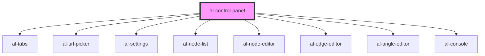

# al-control-panel

<!-- Auto Generated Below -->

## Properties

| Property             | Attribute              | Description | Type                                                           | Default            |
| -------------------- | ---------------------- | ----------- | -------------------------------------------------------------- | ------------------ |
| `angles`             | --                     |             | `Map<string, AlAngle>`                                         | `null`             |
| `consoleTabEnabled`  | `console-tab-enabled`  |             | `boolean`                                                      | `true`             |
| `displayMode`        | `display-mode`         |             | `DisplayMode.MESH \| DisplayMode.SLICES \| DisplayMode.VOLUME` | `DisplayMode.MESH` |
| `edges`              | --                     |             | `Map<string, AlEdge>`                                          | `null`             |
| `graphTabEnabled`    | `graph-tab-enabled`    |             | `boolean`                                                      | `true`             |
| `nodes`              | --                     |             | `Map<string, AlNode>`                                          | `null`             |
| `selected`           | `selected`             |             | `string`                                                       | `null`             |
| `settingsTabEnabled` | `settings-tab-enabled` |             | `boolean`                                                      | `true`             |
| `srcTabEnabled`      | `src-tab-enabled`      |             | `boolean`                                                      | `true`             |
| `stackhelper`        | --                     |             | `StackHelper \| VolumeRenderHelper`                            | `undefined`        |
| `tabContentHeight`   | `tab-content-height`   |             | `string`                                                       | `null`             |
| `url`                | `url`                  |             | `string`                                                       | `null`             |
| `urls`               | --                     |             | `Map<string, string>`                                          | `null`             |

## Dependencies

### Depends on

- [al-tabs](..\al-tabs)
- [al-url-picker](..\al-url-picker)
- [al-settings](..\al-settings)
- [al-node-list](..\al-node-list)
- [al-node-editor](..\al-node-editor)
- [al-edge-editor](..\al-edge-editor)
- [al-angle-editor](..\al-angle-editor)
- [al-console](..\al-console)

### Graph

----------------------------------------------

*Built with [StencilJS](https://stenciljs.com/)*
