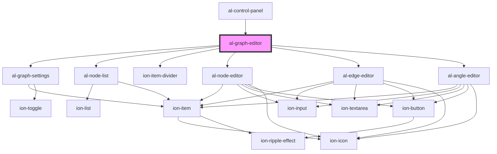

# al-graph-editor

<!-- Auto Generated Below -->

## Properties

| Property       | Attribute       | Description | Type                                | Default     |
| -------------- | --------------- | ----------- | ----------------------------------- | ----------- |
| `angles`       | --              |             | `Map<string, AlAngle>`              | `null`      |
| `edges`        | --              |             | `Map<string, AlEdge>`               | `null`      |
| `graphEnabled` | `graph-enabled` |             | `boolean`                           | `undefined` |
| `graphVisible` | `graph-visible` |             | `boolean`                           | `undefined` |
| `node`         | --              |             | `[string, AlNode]`                  | `undefined` |
| `nodes`        | --              |             | `Map<string, AlNode>`               | `null`      |
| `selected`     | `selected`      |             | `string`                            | `null`      |
| `units`        | `units`         |             | `Units.METERS \| Units.MILLIMETERS` | `undefined` |

## Dependencies

### Used by

 - [al-control-panel](..\al-control-panel)

### Depends on

- [al-graph-settings](..\al-graph-settings)
- [al-node-list](..\al-node-list)
- ion-item-divider
- [al-node-editor](..\al-node-editor)
- [al-edge-editor](..\al-edge-editor)
- [al-angle-editor](..\al-angle-editor)

### Graph

----------------------------------------------

*Built with [StencilJS](https://stenciljs.com/)*
