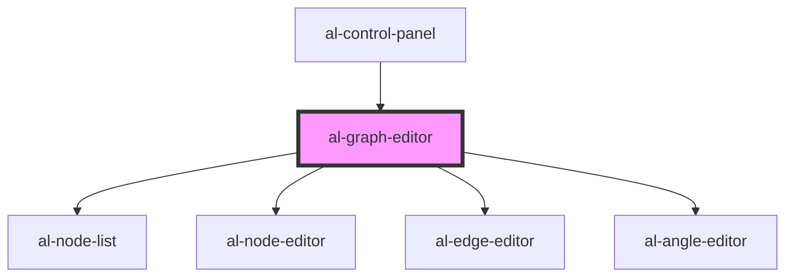

# al-graph-editor

<!-- Auto Generated Below -->

## Properties

| Property   | Attribute  | Description | Type                   | Default     |
| ---------- | ---------- | ----------- | ---------------------- | ----------- |
| `angles`   | --         |             | `Map<string, AlAngle>` | `null`      |
| `edges`    | --         |             | `Map<string, AlEdge>`  | `null`      |
| `node`     | --         |             | `[string, AlNode]`     | `undefined` |
| `nodes`    | --         |             | `Map<string, AlNode>`  | `null`      |
| `selected` | `selected` |             | `string`               | `null`      |

## Dependencies

### Used by

 - [al-control-panel](../al-control-panel)

### Depends on

- [al-node-list](../al-node-list)
- [al-node-editor](../al-node-editor)
- [al-edge-editor](../al-edge-editor)
- [al-angle-editor](../al-angle-editor)

### Graph

----------------------------------------------

*Built with [StencilJS](https://stenciljs.com/)*
