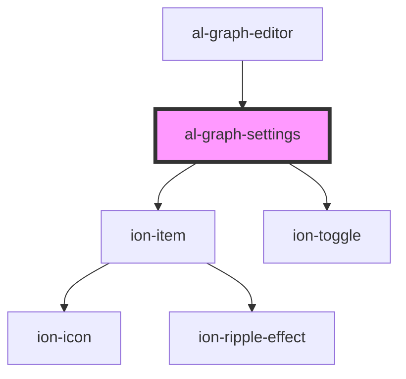

# al-graph-settings

<!-- Auto Generated Below -->

## Properties

| Property       | Attribute       | Description | Type                                | Default     |
| -------------- | --------------- | ----------- | ----------------------------------- | ----------- |
| `graphEnabled` | `graph-enabled` |             | `boolean`                           | `undefined` |
| `graphVisible` | `graph-visible` |             | `boolean`                           | `undefined` |
| `units`        | `units`         |             | `Units.METERS \| Units.MILLIMETERS` | `undefined` |

## Events

| Event                | Description | Type               |
| -------------------- | ----------- | ------------------ |
| `graphEnabledChange` |             | `CustomEvent<any>` |
| `unitsChange`        |             | `CustomEvent<any>` |

## CSS Custom Properties

| Name                             | Description                         |
| -------------------------------- | ----------------------------------- |
| `--bounding-box-enabled-display` | Bounding Box Enabled Toggle Display |
| `--display-mode-display`         | Display Mode Toggle Display         |
| `--graph-enabled-display`        | Graph Enabled Toggle Display        |
| `--slices-index-display`         | Slices Index Range Display          |
| `--slices-orientation-display`   | Slices Orientation Select Display   |
| `--slices-window-center-display` | Slices Window Center Range Display  |
| `--slices-window-width-display`  | Slices Window Width Range Display   |
| `--volume-steps-display`         | Volume Steps Range Display          |
| `--volume-window-center-display` | Volume Window Center Range Display  |
| `--volume-window-width-display`  | Volume Window Width Range Display   |

## Dependencies

### Used by

 - [al-graph-editor](..\al-graph-editor)

### Depends on

- ion-item
- ion-toggle

### Graph

----------------------------------------------

*Built with [StencilJS](https://stenciljs.com/)*
