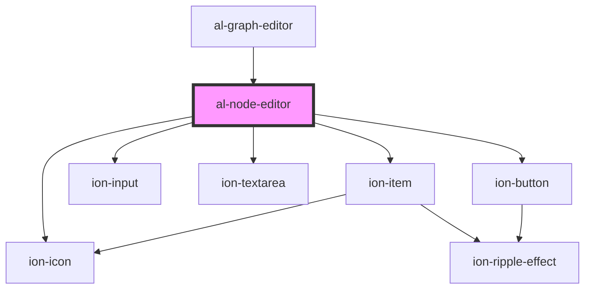

# al-node-editor

<!-- Auto Generated Below -->

## Properties

| Property | Attribute | Description | Type               | Default     |
| -------- | --------- | ----------- | ------------------ | ----------- |
| `node`   | --        |             | `[string, AlNode]` | `undefined` |

## Events

| Event        | Description | Type               |
| ------------ | ----------- | ------------------ |
| `deleteNode` |             | `CustomEvent<any>` |
| `saveNode`   |             | `CustomEvent<any>` |

## Dependencies

### Used by

 - [al-graph-editor](..\al-graph-editor)

### Depends on

- ion-item
- ion-input
- ion-textarea
- ion-button
- ion-icon

### Graph

----------------------------------------------

*Built with [StencilJS](https://stenciljs.com/)*
