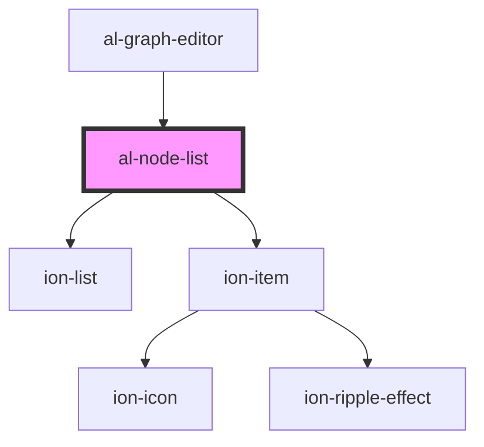

# al-node-list

<!-- Auto Generated Below -->

## Properties

| Property   | Attribute  | Description | Type                  | Default |
| ---------- | ---------- | ----------- | --------------------- | ------- |
| `nodes`    | --         |             | `Map<string, AlNode>` | `null`  |
| `selected` | `selected` |             | `string`              | `null`  |

## Events

| Event            | Description | Type               |
| ---------------- | ----------- | ------------------ |
| `selectedChange` |             | `CustomEvent<any>` |

## Dependencies

### Used by

 - [al-graph-editor](../al-graph-editor)

### Depends on

- ion-list
- ion-item

### Graph

----------------------------------------------

*Built with [StencilJS](https://stenciljs.com/)*
