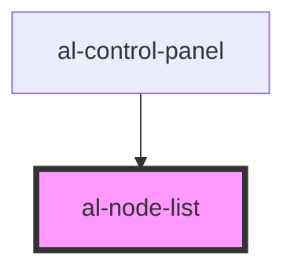

# al-node-list

<!-- Auto Generated Below -->

## Properties

| Property   | Attribute  | Description | Type                  | Default |
| ---------- | ---------- | ----------- | --------------------- | ------- |
| `nodes`    | --         |             | `Map<string, AlNode>` | `null`  |
| `selected` | `selected` |             | `string`              | `null`  |

## Events

| Event             | Description | Type               |
| ----------------- | ----------- | ------------------ |
| `selectedChanged` |             | `CustomEvent<any>` |

## Dependencies

### Used by

 - [al-control-panel](..\al-control-panel)

### Graph

----------------------------------------------

*Built with [StencilJS](https://stenciljs.com/)*
