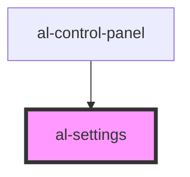

# al-settings

<!-- Auto Generated Below -->

## Properties

| Property                 | Attribute                   | Description | Type                                                               | Default     |
| ------------------------ | --------------------------- | ----------- | ------------------------------------------------------------------ | ----------- |
| `boundingBoxEnabled`     | `bounding-box-enabled`      |             | `boolean`                                                          | `undefined` |
| `controlsType`           | `controls-type`             |             | `ControlsType.ORBIT \| ControlsType.TRACKBALL`                     | `undefined` |
| `displayMode`            | `display-mode`              |             | `DisplayMode.MESH \| DisplayMode.SLICES \| DisplayMode.VOLUME`     | `undefined` |
| `graphEnabled`           | `graph-enabled`             |             | `boolean`                                                          | `undefined` |
| `graphVisible`           | `graph-visible`             |             | `boolean`                                                          | `undefined` |
| `orientation`            | `orientation`               |             | `Orientation.AXIAL \| Orientation.CORONAL \| Orientation.SAGGITAL` | `undefined` |
| `slicesBrightness`       | `slices-brightness`         |             | `number`                                                           | `undefined` |
| `slicesContrast`         | `slices-contrast`           |             | `number`                                                           | `undefined` |
| `slicesIndex`            | `slices-index`              |             | `number`                                                           | `undefined` |
| `slicesMaxIndex`         | `slices-max-index`          |             | `number`                                                           | `undefined` |
| `units`                  | `units`                     |             | `Units.METERS \| Units.MILLIMETERS`                                | `undefined` |
| `volumeBrightness`       | `volume-brightness`         |             | `number`                                                           | `undefined` |
| `volumeContrast`         | `volume-contrast`           |             | `number`                                                           | `undefined` |
| `volumeSteps`            | `volume-steps`              |             | `number`                                                           | `undefined` |
| `volumeStepsHighEnabled` | `volume-steps-high-enabled` |             | `boolean`                                                          | `undefined` |

## Events

| Event                           | Description | Type               |
| ------------------------------- | ----------- | ------------------ |
| `boundingBoxEnabledChanged`     |             | `CustomEvent<any>` |
| `controlsTypeChanged`           |             | `CustomEvent<any>` |
| `displayModeChanged`            |             | `CustomEvent<any>` |
| `graphEnabledChanged`           |             | `CustomEvent<any>` |
| `orientationChanged`            |             | `CustomEvent<any>` |
| `recenter`                      |             | `CustomEvent<any>` |
| `slicesBrightnessChanged`       |             | `CustomEvent<any>` |
| `slicesContrastChanged`         |             | `CustomEvent<any>` |
| `slicesIndexChanged`            |             | `CustomEvent<any>` |
| `unitsChanged`                  |             | `CustomEvent<any>` |
| `volumeBrightnessChanged`       |             | `CustomEvent<any>` |
| `volumeContrastChanged`         |             | `CustomEvent<any>` |
| `volumeStepsChanged`            |             | `CustomEvent<any>` |
| `volumeStepsHighEnabledChanged` |             | `CustomEvent<any>` |

## CSS Custom Properties

| Name                             | Description                         |
| -------------------------------- | ----------------------------------- |
| `--bounding-box-enabled-display` | Bounding Box Enabled Toggle Display |
| `--display-mode-display`         | Display Mode Toggle Display         |
| `--graph-enabled-display`        | Graph Enabled Toggle Display        |
| `--slices-index-display`         | Slices Index Range Display          |
| `--slices-orientation-display`   | Slices Orientation Select Display   |
| `--slices-window-center-display` | Slices Window Center Range Display  |
| `--slices-window-width-display`  | Slices Window Width Range Display   |
| `--volume-steps-display`         | Volume Steps Range Display          |
| `--volume-window-center-display` | Volume Window Center Range Display  |
| `--volume-window-width-display`  | Volume Window Width Range Display   |

## Dependencies

### Used by

 - [al-control-panel](../al-control-panel)

### Graph

----------------------------------------------

*Built with [StencilJS](https://stenciljs.com/)*
