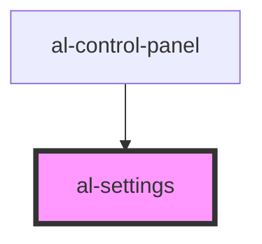

# al-control-panel

<!-- Auto Generated Below -->

## Properties

| Property             | Attribute              | Description | Type                                                                                           | Default               |
| -------------------- | ---------------------- | ----------- | ---------------------------------------------------------------------------------------------- | --------------------- |
| `boundingBoxEnabled` | `bounding-box-enabled` |             | `boolean`                                                                                      | `false`               |
| `controlsType`       | `controls-type`        |             | `ControlsType.ORBIT \| ControlsType.TRACKBALL`                                                 | `ControlsType.ORBIT`  |
| `displayMode`        | `display-mode`         |             | `DisplayMode.MESH \| DisplayMode.SLICES \| DisplayMode.VOLUME`                                 | `DisplayMode.MESH`    |
| `graphEnabled`       | `graph-enabled`        |             | `boolean`                                                                                      | `false`               |
| `material`           | `material`             |             | `Material.CLAY \| Material.DEFAULT \| Material.NORMALS \| Material.WIREFRAME \| Material.XRAY` | `Material.DEFAULT`    |
| `orientation`        | `orientation`          |             | `Orientation.AXIAL \| Orientation.CORONAL \| Orientation.SAGGITAL`                             | `Orientation.CORONAL` |
| `slicesIndex`        | `slices-index`         |             | `number`                                                                                       | `undefined`           |
| `slicesWindowCenter` | `slices-window-center` |             | `number`                                                                                       | `undefined`           |
| `slicesWindowWidth`  | `slices-window-width`  |             | `number`                                                                                       | `undefined`           |
| `stackhelper`        | --                     |             | `StackHelper \| VolumeRenderHelper`                                                            | `undefined`           |
| `units`              | `units`                |             | `Units.METERS \| Units.MILLIMETERS`                                                            | `Units.METERS`        |
| `volumeSteps`        | `volume-steps`         |             | `number`                                                                                       | `undefined`           |
| `volumeWindowCenter` | `volume-window-center` |             | `number`                                                                                       | `undefined`           |
| `volumeWindowWidth`  | `volume-window-width`  |             | `number`                                                                                       | `undefined`           |

## Events

| Event                       | Description | Type               |
| --------------------------- | ----------- | ------------------ |
| `boundingBoxEnabledChanged` |             | `CustomEvent<any>` |
| `controlsTypeChanged`       |             | `CustomEvent<any>` |
| `displayModeChanged`        |             | `CustomEvent<any>` |
| `graphEnabledChanged`       |             | `CustomEvent<any>` |
| `materialChanged`           |             | `CustomEvent<any>` |
| `orientationChanged`        |             | `CustomEvent<any>` |
| `recenter`                  |             | `CustomEvent<any>` |
| `slicesIndexChanged`        |             | `CustomEvent<any>` |
| `slicesWindowCenterChanged` |             | `CustomEvent<any>` |
| `slicesWindowWidthChanged`  |             | `CustomEvent<any>` |
| `unitsChanged`              |             | `CustomEvent<any>` |
| `volumeStepsChanged`        |             | `CustomEvent<any>` |
| `volumeWindowCenterChanged` |             | `CustomEvent<any>` |
| `volumeWindowWidthChanged`  |             | `CustomEvent<any>` |

## CSS Custom Properties

| Name                             | Description                         |
| -------------------------------- | ----------------------------------- |
| `--bounding-box-enabled-display` | Bounding Box Enabled Toggle Display |
| `--display-mode-display`         | Display Mode Toggle Display         |
| `--graph-enabled-display`        | Graph Enabled Toggle Display        |
| `--slices-index-display`         | Slices Index Range Display          |
| `--slices-orientation-display`   | Slices Orientation Select Display   |
| `--slices-window-center-display` | Slices Window Center Range Display  |
| `--slices-window-width-display`  | Slices Window Width Range Display   |
| `--volume-steps-display`         | Volume Steps Range Display          |
| `--volume-window-center-display` | Volume Window Center Range Display  |
| `--volume-window-width-display`  | Volume Window Width Range Display   |

## Dependencies

### Used by

 - [al-control-panel](..\al-control-panel)

### Graph

----------------------------------------------

*Built with [StencilJS](https://stenciljs.com/)*
