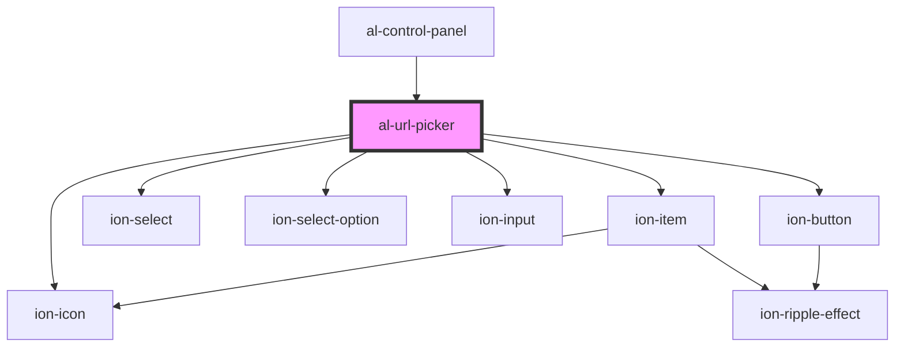

# al-url-picker

<!-- Auto Generated Below -->

## Properties

| Property | Attribute | Description | Type                  | Default |
| -------- | --------- | ----------- | --------------------- | ------- |
| `url`    | `url`     |             | `string`              | `null`  |
| `urls`   | --        |             | `Map<string, string>` | `null`  |

## Events

| Event       | Description | Type               |
| ----------- | ----------- | ------------------ |
| `urlChange` |             | `CustomEvent<any>` |

## Dependencies

### Used by

 - [al-control-panel](..\al-control-panel)

### Depends on

- ion-item
- ion-select
- ion-select-option
- ion-input
- ion-button
- ion-icon

### Graph

----------------------------------------------

*Built with [StencilJS](https://stenciljs.com/)*
