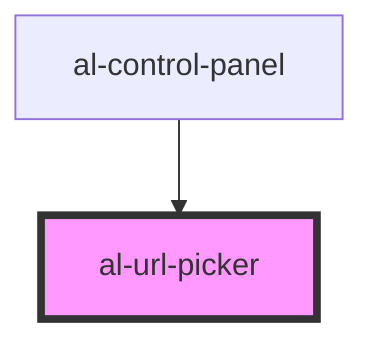

# al-url-picker

<!-- Auto Generated Below -->

## Properties

| Property | Attribute | Description | Type                  | Default |
| -------- | --------- | ----------- | --------------------- | ------- |
| `url`    | `url`     |             | `string`              | `null`  |
| `urls`   | --        |             | `Map<string, string>` | `null`  |

## Events

| Event        | Description | Type               |
| ------------ | ----------- | ------------------ |
| `urlChanged` |             | `CustomEvent<any>` |

## Dependencies

### Used by

 - [al-control-panel](../al-control-panel)

### Graph

----------------------------------------------

*Built with [StencilJS](https://stenciljs.com/)*
