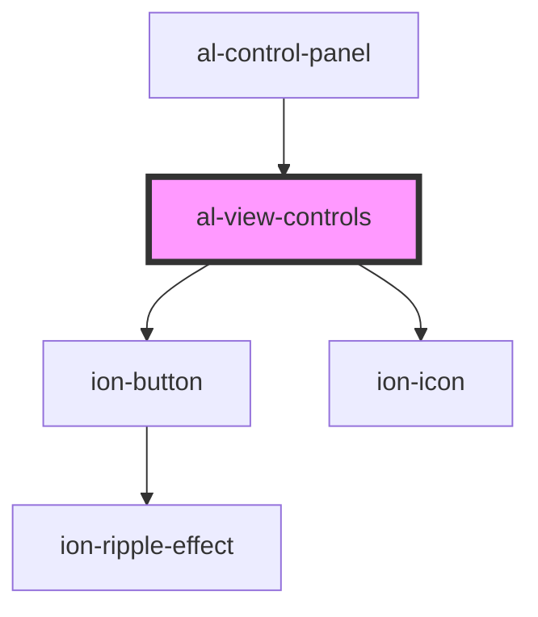

# al-view-controls

<!-- Auto Generated Below -->

## Properties

| Property             | Attribute              | Description | Type                                           | Default     |
| -------------------- | ---------------------- | ----------- | ---------------------------------------------- | ----------- |
| `boundingBoxEnabled` | `bounding-box-enabled` |             | `boolean`                                      | `undefined` |
| `controlsType`       | `controls-type`        |             | `ControlsType.ORBIT \| ControlsType.TRACKBALL` | `undefined` |

## Events

| Event                       | Description | Type               |
| --------------------------- | ----------- | ------------------ |
| `boundingBoxEnabledChanged` |             | `CustomEvent<any>` |
| `controlsTypeChanged`       |             | `CustomEvent<any>` |
| `recenter`                  |             | `CustomEvent<any>` |

## CSS Custom Properties

| Name                             | Description                         |
| -------------------------------- | ----------------------------------- |
| `--bounding-box-enabled-display` | Bounding Box Enabled Toggle Display |
| `--display-mode-display`         | Display Mode Toggle Display         |
| `--graph-enabled-display`        | Graph Enabled Toggle Display        |
| `--slices-index-display`         | Slices Index Range Display          |
| `--slices-orientation-display`   | Slices Orientation Select Display   |
| `--slices-window-center-display` | Slices Window Center Range Display  |
| `--slices-window-width-display`  | Slices Window Width Range Display   |
| `--volume-steps-display`         | Volume Steps Range Display          |
| `--volume-window-center-display` | Volume Window Center Range Display  |
| `--volume-window-width-display`  | Volume Window Width Range Display   |

## Dependencies

### Used by

 - [al-control-panel](../al-control-panel)

### Depends on

- ion-button
- ion-icon

### Graph

----------------------------------------------

*Built with [StencilJS](https://stenciljs.com/)*
